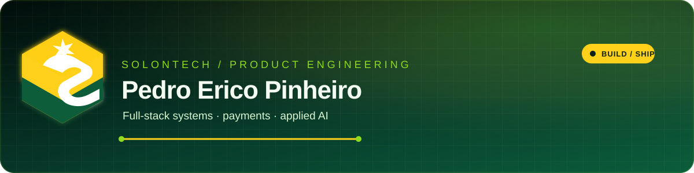

  
    
  
  
  

<table>
<tr>
<td valign="top" width="62%">

## Engineering profile

I am a full-stack developer with 8+ years of experience building web applications, integrations and evolving software systems. I work from product context to production runtime, with a focus on reliable delivery.

At [SolonTech](https://www.solontech.com.br/), I build independent SaaS products across payments, customer service, commerce and automation. My applied AI work includes conversational agents, LLM integrations, RAG, semantic search, function calling and multi-tenant guardrails.

- Based in Brazil
- Senior full-stack, backend and applied AI focus
- Comfortable with architecture, legacy modernization, testing and AWS infrastructure

</td>
<td valign="top" width="38%">

## Build signal

<code>solontech / engineering</code>

**Payments** queues · webhooks · reconciliation

**Product systems** APIs · dashboards · automation

**Applied AI** RAG · agents · semantic search

**Delivery** quality gates · observability · AWS

</td>
</tr>
</table>

## Contribution pulse

Product activity snapshot · September 2026 · <a href="https://github.com/pedroerico?tab=overview">open the live contribution graph</a>

<table>
<tr>
<td align="center" width="25%"><strong>8+</strong> years building software</td>
<td align="center" width="25%"><strong>180</strong> product commits in this snapshot</td>
<td align="center" width="25%"><strong>3</strong> SolonTech product repositories</td>
<td align="center" width="25%"><strong>4</strong> engineering focus areas</td>
</tr>
</table>

  

## Core stack

  
  
  
  
  
  
  
  
  
  
  
  

## Selected public work

<table>
<tr>
<td valign="top" width="50%">

### GatewayPay API

Laravel payment API with queues, webhooks and circuit breaker strategy.

[View repository →](https://github.com/pedroerico/gateway-pay-api)

</td>
<td valign="top" width="50%">

### GatewayPay Frontend

Vue.js interface for the GatewayPay project.

[View repository →](https://github.com/pedroerico/gateway-pay)

</td>
</tr>
<tr>
<td valign="top" width="50%">

### Symfony CRUD API

Symfony 5.4 API with validation and automated tests.

[View repository →](https://github.com/pedroerico/CRUD_completo_api)

</td>
<td valign="top" width="50%">

### Bank Management API

Banking management API built with Laravel.

[View repository →](https://github.com/pedroerico/bank-management-API)

</td>
</tr>
</table>

## How I build

<code>design the boundary → make the flow observable → test the failure path → ship the smallest safe change</code>

[LinkedIn](https://www.linkedin.com/in/pedroerico/) · [SolonTech](https://www.solontech.com.br/) · [Email](mailto:pedroerico.desenvolvedor@gmail.com)

Theme inspired by SolonTech: deep green, bright green and signal yellow.
